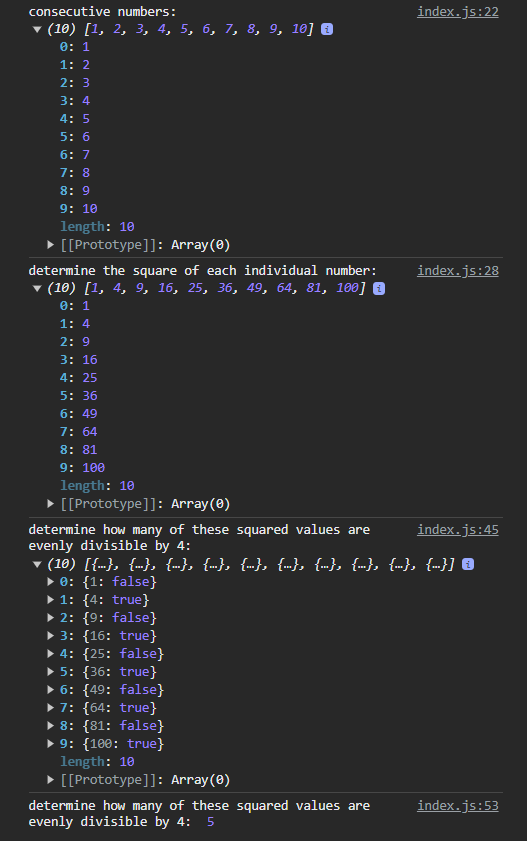

# Simple JavaScript Exercise

A simple JavaScript excercise

## Running the App

- Find the `index.html` file
- Double click `index.html` file to load it on the browser
- Open the browser `console` by `right-clicking inspect element`
- Click on the `console` tab

## Screenshot

